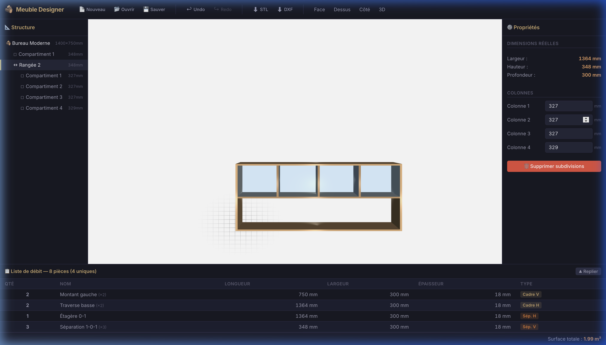

# 🪵 Furniture Designer

> An interactive furniture design tool based on **JSCAD**, allowing for recursive subdivision of compartments and automatic generation of cut lists for fabrication.



🔨 **Live Application:** [https://furniture.bibabox.fr/](https://furniture.bibabox.fr/)
📚 **Documentation:** [https://bewiwi.github.io/Furniture-Designer/](https://bewiwi.github.io/Furniture-Designer/)

## ✨ Features

- **Interactive 3D Modeling**: Real-time visualization of your furniture using the `regl-renderer` engine.
- **Recursive Subdivision**: Divide any compartment into **rows** (horizontal) or **columns** (vertical) infinitely.
- **Dynamic Management**: Change global dimensions (width, height, depth, thickness) and see changes instantly.
- **Cut List Generation**: Automatic summary table of all parts including:
    - Exact dimensions (Length x Width x Thickness).
    - Grouping of identical pieces.
    - Total surface area calculation (m²).
- **Multi-Format Exports**:
    - **📦 JSON**: Save and restore your projects.
    - **🛠️ STL**: For 3D printing or importing into other CAD software.
    - **📐 DXF**: For CNC or laser cutting.
- **Full History**: **Undo/Redo** support (Ctrl+Z / Ctrl+Y) with local persistence (`localStorage`).
- **Themes**: Switch between **Dark Workshop** and **Light Mode** using the theme toggle.

## 🚀 Installation & Launch

### Docker (Recommended)
You can run the application instantly using the pre-built image from **GHCR**:
```bash
docker run -d -p 8080:80 ghcr.io/bewiwi/furniture-designer:latest
```
**Live Demo:** [https://furniture.bibabox.fr/](https://furniture.bibabox.fr/)

### Local Development
1. Clone the repository:
   ```bash
   git clone https://github.com/bewiwi/Furniture-Designer.git
   cd Furniture-Designer
   ```
2. Install dependencies:
   ```bash
   npm install
   ```
3. Start the application development server:
   ```bash
   npm run dev
   ```
The application will be available at [http://localhost:5173/](http://localhost:5173/).

4. Start the **documentation** development server (VitePress):
   ```bash
   npm run docs:dev
   ```
The multi-lingual documentation will be available at [http://localhost:5174/](http://localhost:5174/).

### Production Build
To generate optimized static files:
```bash
npm run build
```

## 🛠️ Technical Stack

- **Core Logic**: JavaScript (ES6+).
- **3D Engine**: [@jscad/modeling](https://github.com/jscad/OpenJSCAD.org) & [@jscad/regl-renderer](https://github.com/jscad/OpenJSCAD.org).
- **Bundler**: [Vite](https://vitejs.dev/).
- **UI**: Vanilla CSS & Custom Component Framework (optimized DOM rendering).
- **Persistence**: Browser `localStorage`.

## 📖 Usage Guide

1. **Global Configuration**: Use the right panel ("Properties") to define the outer dimensions of your furniture.
2. **Subdivision**: Select a compartment in the "Hierarchy" tree or directly in the list, then choose to subdivide it into rows or columns.
3. **Adjustment**: You can resize each subdivision individually via the form.
4. **Export**: Once satisfied, use the toolbar to export your cut list or 3D files.

## 📜 License

Project created as a custom furniture design tool. All rights reserved.
